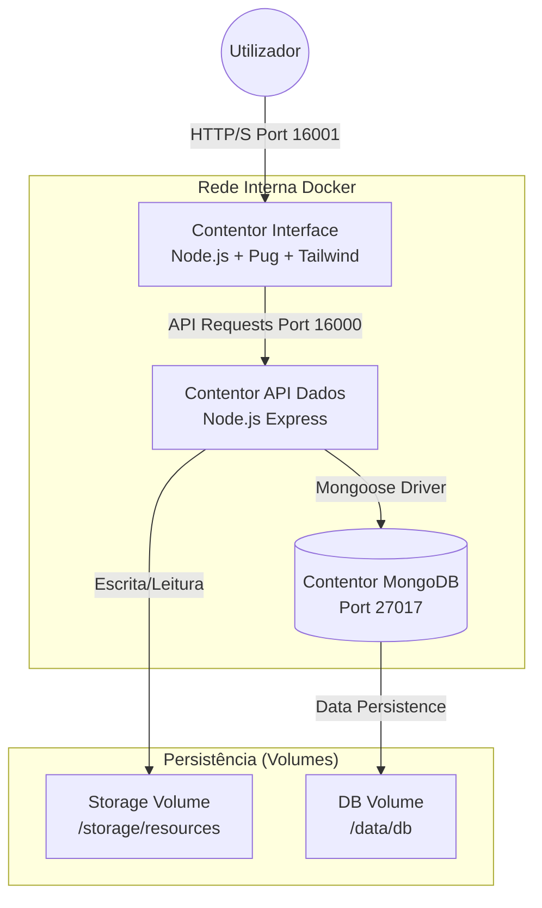
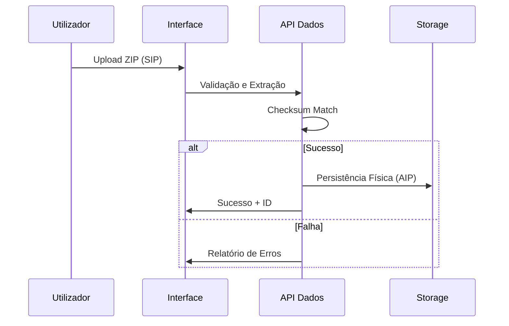

# Relatório Técnico: EduPortal - Plataforma de Gestão de Recursos Educativos

**Unidade Curricular:** Engenharia Web (2025/2026)  

**Projeto:** Proposta 1 - Plataforma de Gestão e Disponibilização de Recursos Educativos  

**Autores:** Francisco Barbosa (A107286), Pedro Morais (A107319), Simão Araújo (A106855)

**Instituição:** Universidade do Minho - Escola de Engenharia  

---

## Resumo (Abstract)
Este documento descreve a conceção e implementação do **EduPortal**, um sistema full-stack desenhado para a gestão, preservação e disseminação de recursos educativos digitais. A plataforma utiliza uma arquitetura de microserviços contentorizados (Docker), baseada em Node.js e MongoDB, seguindo rigorosamente as diretrizes do modelo **OAIS (Open Archival Information System)**. O sistema implementa processos estruturados de ingestão (SIP), armazenamento persistente (AIP) e disseminação (DIP), garantindo a integridade dos dados através de validações baseadas no padrão **BagIt**. Além da gestão de ficheiros, a plataforma oferece uma camada social robusta com rankings, comentários e feed de notícias automático, operando sob um sistema de controlo de acessos por níveis (RBAC) e visibilidade granular.

---

## 1. Introdução e Objetivos

### 1.1. Contexto
No ecossistema académico moderno, a produção de conteúdos digitais é vasta. O EduPortal surge como uma solução para organizar material de diversas Unidades Curriculares (Engenharia Web, RPCW, ATP, etc.), garantindo a sua preservação e facilitando a interação entre docentes e alunos.

### 1.2. Objetivos Alcançados
- **Preservação Digital:** Validação BagIt de pacotes SIP.
- **Disseminação Flexível:** Geração de pacotes DIP idênticos à submissão.
- **Controlo de Acesso:** Diferenciação entre Admin, Produtor e Consumidor.
- **Visibilidade Granular:** Suporte para recursos Públicos e Privados.
- **Comunidade:** Feed de notícias automático e sistema de ratings/comentários.

---

## 2. Arquitetura e Stack Tecnológica

O sistema segue uma topologia de microserviços distribuídos, garantindo isolamento e segurança.

### 2.1. Diagrama de Infraestrutura (Docker)

### 2.2. Componentes Principais
- **Back-end (`api_dados`):** Gere a lógica de negócio, persistência e validação BagIt.
- **Front-end (`interface`):** Interface moderna com **Tailwind CSS** e renderização **Pug (SSR)**.
- **Storage:** Sistema de ficheiros local persistido, simulando um serviço de Object Storage profissional.

---

## 3. Modelo de Dados e Metainformação

A modelação em MongoDB foi desenhada para ser extensível, permitindo a adição de novos tipos de recursos sem alterações estruturais.

### 3.1. Tipologia de Recursos
O sistema suporta nativamente os seguintes tipos:
-   `Tese`, `Artigo`, `Slides`, `Relatório`, `Aplicação`.
-   **Novos tipos adicionados:** `Teste / Exame` e `Problema Resolvido`.

### 3.2. Controlo de Visibilidade
Implementou-se um sistema de privacidade onde:
-   **Público:** Visível por todos os utilizadores e visitantes.
-   **Privado:** Apenas visível e descarregável pelo **Produtor** original e pelo **Administrador**.
-   **Filtragem na Fonte:** A API de Dados filtra automaticamente os resultados antes de os enviar para a interface, garantindo que recursos privados não "vazam" em listas de pesquisa.

---

## 4. Implementação do Fluxo OAIS e Automação

### 4.1. Ingestão e Disseminação (SIP/DIP)
O processo utiliza o `bagitValidator.js` para assegurar que cada submissão (ZIP) contém um manifesto válido e que a integridade dos ficheiros se mantém através de checksums.

### 4.2. Notícias Automáticas
O feed de notícias é alimentado em tempo real por gatilhos (triggers) no backend:
1.  **Submissão:** Notícia gerada ao terminar uma ingestão SIP com sucesso.
2.  **Registo:** Notícia gerada após a criação de um novo perfil.
3.  **Ranking:** Notícia de "Top 3" gerada dinamicamente quando um recurso atinge um novo patamar de downloads.

---

## 5. Povoamento de Dados (Demonstração Final)

Para a demonstração final, foi desenvolvido um script de povoamento massivo (`populate_complete.js`) que preenche a plataforma com:
-   **Utilizadores Reais:** Docentes da UMinho e alunos com emails `@alunos.uminho.pt`.
-   **Material de UCs:** 35 recursos reais baseados em Engenharia Web, RPCW, ATP, Programação Imperativa e Compiladores.
-   **Interação:** Discussões e ratings pré-carregados para demonstrar a dinamismo da plataforma.

---

## 6. Segurança e Boas Práticas

### 6.1. Proteção contra Vulnerabilidades
-   **NoSQL Injection:** Mitigado pelo uso de **Mongoose Schemas**, que forçam a tipagem de dados e impedem a execução de comandos MongoDB maliciosos via objetos.
-   **Path Traversal:** Implementada validação por **Regex** nos IDs de recursos para impedir o acesso a pastas fora do `storage/resources`.
-   **XSS (Cross-Site Scripting):** O motor **Pug** escapa automaticamente todo o conteúdo introduzido por utilizadores em posts e comentários.
-   **Isolamento:** A API de dados está numa rede Docker privada, sendo inacessível diretamente de fora do ecossistema.

---

## 7. Conclusão

O EduPortal cumpre integralmente os requisitos da Proposta 1. A implementação profissional da separação entre metadados (MongoDB) e conteúdo (FileSystem Storage), aliada à validação rigorosa de pacotes SIP, resulta numa plataforma robusta e escalável, preparada para um ambiente académico real.

---
**Simão Araújo, Francisco Barbosa, Pedro Morais - 2026**
